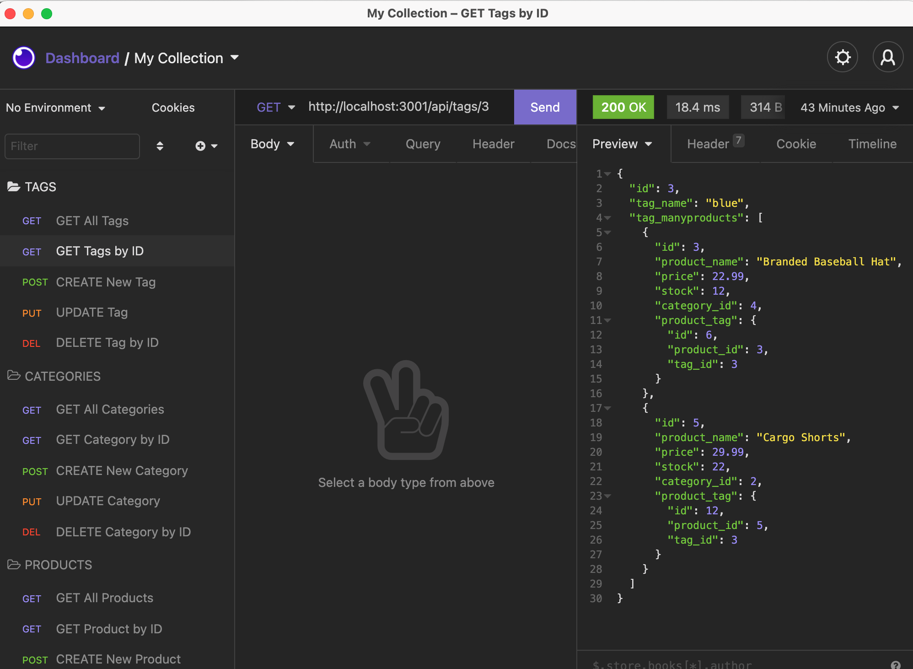

# E-Commerce Back End

 

This is a command-line application that provides a solution for easily managing a company's employees using node, the Inquirer package, and MySQL. It allows employers to view and manage different aspects of the departments, roles, and employees in their company. 

It allows users to add, delete, and view employees, roles, and departments - as well as updating roles and managers - or viewing departments' budgets.
    
## Table of Contents
 - [Installation](#installation)
 - [Usage](#usage)
 - [License](#license)
 - [Credits](#credits)
 - [Questions](#questions)
    
    
## Installation

The server is started through the command-line, and then the application can be tested using something similar to Insomnia Core. 

To use this application, clone and download the files from this repository. Run 'npm install' to install the packages included in the package.json (required packages are MySQL2, Sequelize, dotenv, and Express.js).

The schema.sql file can be used to create a MySQL database. A .env file must be created that includes the username, password, and new database name. Run 'npm run seed' in the command-line to populate the database tables (from the seeds.js files). The server can then be started in the command-line by running npm start. 
    
## Usage

Once everything is downloaded, installed, and created (and the server is running), test the routes using Insomnia Core (or something similar). 

Run API GET routes for categories, products, or tags to see data from the database displayed as formatted JSON. (Find the syntax for the routes in the respective routes.js files: i.e., GET all tags would be 'http://localhost:3001/api/tags/').
Test API POST, PUT, and DELETE routes for categories, products, or tags in Insomnia Core to create, update, or delete data in the database. 

*See a video of the application in use [here](https://www.awesomescreenshot.com/video/4499834?key=e6b97f1ebf7ef168da3c5341bb964790).*

*(Click on GIF to be taken to the full video of the walkthrough.)*

*Use Insomnia Core to test different API routes*

## License

This project is licensed under [MIT License](https://opensource.org/licenses/MIT).

## Credits

Starter front-end code provided by the University of Minnesota Coding Bootcamp.

## Questions

See more of my work on my [GitHub Profile](https://github.com/msteblu/).
For any additional questions, reach me at my email: megan@steblay.net.